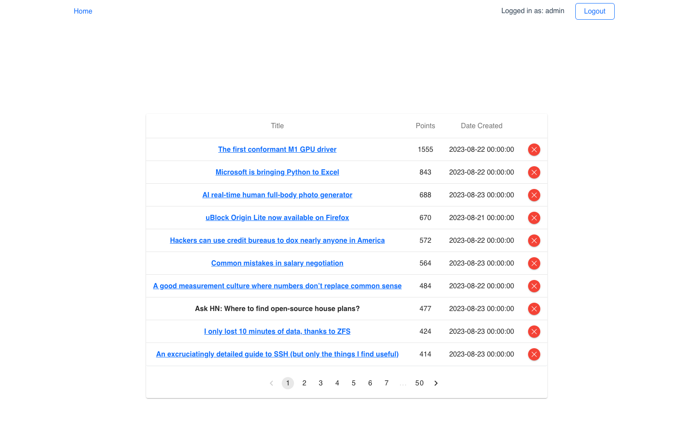

# Scraper

<h2>Console</h2>

Clone <b>.env.example</b> and rename it to <b>.env</b>

Change DB settings
``` env
DB_CONNECTION=mysql
DB_HOST=mysql
DB_PORT=3306
DB_DATABASE=scraper
DB_USERNAME=sail
DB_PASSWORD=password
```

Go to console folder, install composer, migrate db and launch docker container
```
cd console
```
```
composer install --ignore-platform-reqs
```
```
./vendor/bin/sail up -d
```
```
./vendor/bin/sail php artisan migrate
```

Insert stories from HackerNews (Cron jobs inserts new top-stories each hour if it isn't already in database)
```
./vendor/bin/sail php artisan insert:top-stories
```

<h2>Front End</h2>

Go to front-end folder, install npm and start server
```
cd front-end
```
```
npm install --force
```
```
npm run serve
```

Page preview

